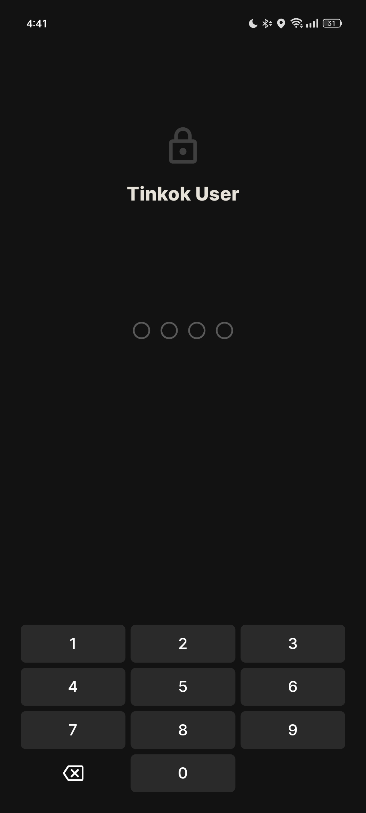

# tinkok

This is a WIP reimagined mobile app for Tinkoff Bank.

Source code for this wasn't meant to go public this soon but my portfolio is pretty much empty and I'm looking for job so here we are.

The main focus of the app is clean UI with some funny animations so everything else might be lacking (code included).

## Gallery

Props to [@evaqum](https://github.com/evaqum) for designing this, truly the only person I can sometimes trust

https://github.com/evaqum/tinkok/assets/54950997/94be487e-414a-4774-a7a0-dc436a9c9180

More things coming in like a year.

## Some features and plans

- [x] **App Lock** to prevent money stealing (passcode is 1234 for everyone tho)
- [x] Cool animations
- [ ] Can cure being ***broke***
- [ ] **OLEZHA** the slightly-agressive AI Chat assistant
- [ ] Setting
- [ ] Money stealer

---

i sure hope i'll get better with git and will commit regularly instead of once in a lifetime
